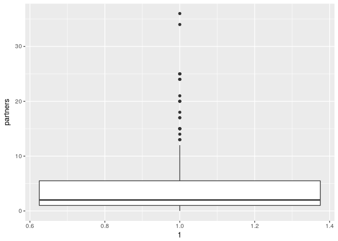

Let's Talk About Sex
================
Max Bartlett, Jennifer Chin, and Liam Pulsifer
22 April, 2018

Introduction
------------

### Description of Data

For our final project, we wanted to analyze the number of sexual partners that college students, primarily those at Duke, have had and whether or not that number correlates to a range of demographic factors, such as religion, year in school, or political views. We collected our own data for this project using a Qualtrics survey. This survey was relatively short and had 14 questions. The results of these questions are stored in the variables below:

1.  `student`: Are you a college student?
2.  `college`: Which college do you go to?
3.  `year`: Which year in college are you?
4.  `age`: What is your age?
5.  `gender`: What is your gender?
6.  `major`: What is your major?
7.  `athlete`: Are you a student athlete?
8.  `greek`: Are you involved in a fraternity or sorority?
9.  `politics`: How would you describe your political views? (There were 5 options for this question: Very Conservative, Somewhat Conservative, Neither, Somewhat Liberal, and Very Liberal)
10. `religious`: Would you consider yourself to be religious?
11. `religion`: If so, which religion do you practice?
12. `partners`: In your life, how many sexual partners have you had?
13. `partners`: Since coming to college, how many sexual partners have you had?
14. `relationship`: Are you currently in a committed romantic relationship that has lasted longer than 1 month?

To get answers to our survey, we asked our friends to fill it out and also posted the survey in the All Duke Facebook group and the class Slack channel. We received 394 submissions in less than 2 days. After poring over the responses, we removed ones with no answers filled in and ones that were evidently bogus, and were left with 361 observations. Additionally, we split the `major` column into `major_one` and `major_two` to account for people who listed two majors.

Research Question
-----------------

Our research question is "Which demographic factors are most strongly associated with number of sexual partners in college students?" To answer this question using the data we collected (described above), we first need to clean the data and remove some unnecessary variables and observations.

We chose to filter the data for students at Duke because we didn't get enough responses from non-Duke students to do any meaningful analysis. We also chose to remove some variables, such as ip\_address from which the survey was taken, which we deemed extraneous.

    ## # A tibble: 1 x 8
    ##     max   min  mean median    sd    q1    q3   num
    ##   <dbl> <dbl> <dbl>  <int> <dbl> <dbl> <dbl> <int>
    ## 1  36.0     0  4.41      2  5.81  1.00  5.50   319

    ## # A tibble: 1 x 8
    ##     max   min  mean median    sd    q1    q3   num
    ##   <dbl> <dbl> <dbl>  <int> <dbl> <dbl> <dbl> <int>
    ## 1  25.0     0  3.22      2  4.53  1.00  4.00   317

    ## # A tibble: 9 x 9
    ##   major_one                 max   min  mean median    sd    q1    q3   num
    ##   <chr>                   <dbl> <dbl> <dbl>  <dbl> <dbl> <dbl> <dbl> <int>
    ## 1 Economics                25.0     0  5.93   4.00  6.45 1.00   8.25    28
    ## 2 Biology                  36.0     0  5.91   2.00  8.28 1.00   9.00    35
    ## 3 Public Policy Studies    15.0     0  5.25   5.00  4.23 1.75   8.00    28
    ## 4 Neuroscience             25.0     0  4.95   3.00  6.23 1.00   7.00    21
    ## 5 Computer Science         34.0     0  4.46   2.00  7.10 1.00   5.00    41
    ## 6 Electrical & Computer …  17.0     0  4.35   2.00  4.97 1.00   7.25    20
    ## 7 Psychology               14.0     0  3.46   1.00  4.41 1.00   6.00    13
    ## 8 Mechanical Engineering   15.0     0  3.38   2.00  4.17 1.00   4.00    13
    ## 9 Biomedical Engineering   10.0     0  2.81   1.00  3.10 0.750  4.25    16

    ## # A tibble: 4 x 9
    ##   year        max   min  mean median    sd    q1    q3   num
    ##   <chr>     <dbl> <dbl> <dbl>  <dbl> <dbl> <dbl> <dbl> <int>
    ## 1 Freshman   24.0     0  2.78   1.00  4.35  0     3.25    68
    ## 2 Sophomore  34.0     0  4.47   2.00  5.74  1.00  5.00   118
    ## 3 Junior     24.0     0  4.55   2.00  4.87  1.00  6.00    66
    ## 4 Senior     36.0     0  5.92   3.00  7.66  1.00  8.00    64

Conclusion/Discussion (1-2 pgs)
-------------------------------

### Critiques/Suggestions for Improvement

##### Issues pertaining to the reliability and validity of your data, and appropriateness of the statistical analysis should be discussed here.

##### A paragraph on what you would do differently if you were able to start over with the project or what you would do next if you were going to continue work on the project should also be included.

Because our survey was voluntary and taken primarily by Duke students and people we know, we are aware that our data may be skewed and not necessarily completely representative. In other words, our data is definitely subject to voluntary response bias. **add more**
