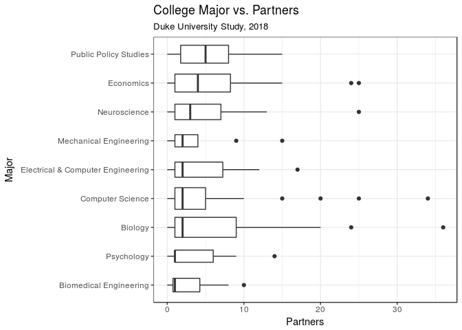
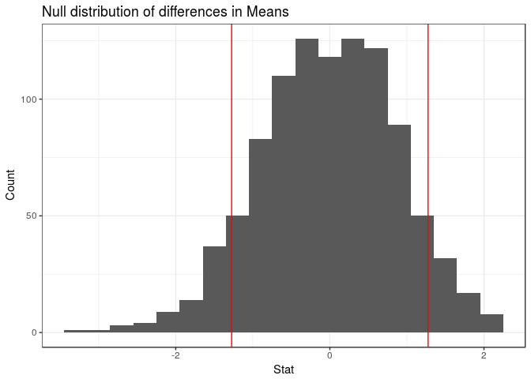

Let's Talk About Sex
================
Max Bartlett, Jennifer Chin, and Liam Pulsifer
05 May, 2018

Introduction
------------

### Description of Data

For our final project, we wanted to analyze the number of sexual partners that college students, primarily those at Duke, have had and whether or not that number correlates to a range of demographic factors, such as religion, year in school, or political views. We collected our own data for this project using a Qualtrics survey. This survey was relatively short and had 14 questions. The results of these questions are stored in the variables below:

1.  `student`: Are you a college student?
2.  `college`: Which college do you go to?
3.  `year`: Which year in college are you?
4.  `age`: What is your age?
5.  `gender`: What is your gender?
6.  `major`: What is your major?
7.  `athlete`: Are you a student athlete?
8.  `greek`: Are you involved in a fraternity or sorority?
9.  `politics`: How would you describe your political views? (There were 5 options for this question: Very Conservative, Somewhat Conservative, Neither, Somewhat Liberal, and Very Liberal)
10. `religious`: Would you consider yourself to be religious?
11. `religion`: If so, which religion do you practice?
12. `partners`: In your life, how many sexual partners have you had?
13. `partners`: Since coming to college, how many sexual partners have you had?
14. `relationship`: Are you currently in a committed romantic relationship that has lasted longer than 1 month?

To get answers to our survey, we asked our friends to fill it out and also posted the survey in the All Duke Facebook group and the class Slack channel. We received 394 submissions in less than 2 days. After pouring over the responses, we removed ones with no answers filled in and ones that were evidently bogus, and were left with 361 observations. Additionally, we split the `major` column into `major_one` and `major_two` to account for people who listed two majors.

Research Question
-----------------

Our research question is "Which demographic factors are most strongly associated with number of sexual partners in college students?" To answer this question using the data we collected (described above), we first need to clean the data and remove some unnecessary variables and observations.

We chose to filter the data for students at Duke because we didn't get enough responses from non-Duke students to do any meaningful analysis. We also chose to remove some variables, such as ip\_address from which the survey was taken, which we deemed extraneous.

### Summary Statistics

The following tibble and lists the summary statistics for the total number of partners and the number of partners since coming to college from the responses in our dataset.

    ## # A tibble: 1 x 8
    ##     max   min  mean median    sd    q1    q3   num
    ##   <dbl> <dbl> <dbl>  <int> <dbl> <dbl> <dbl> <int>
    ## 1   36.    0.  4.41      2  5.81    1.  5.50   319

    ## # A tibble: 1 x 8
    ##     max   min  mean median    sd    q1    q3   num
    ##   <dbl> <dbl> <dbl>  <int> <dbl> <dbl> <dbl> <int>
    ## 1   25.    0.  3.22      2  4.53    1.    4.   317

The mean number of total partners is greater than the mean number of partners since coming to college, yet the median number of partners stays the same, at two. This is an interesting observation, as we expected the median to increase as well. This may indicate that those who are already having sex continue to have new partners in college, and those who didn't have sex in high school are continuing to abstain from sex.

#### Sexual Activity Groupings

We can split students into four groups based on whether or not they were sexually active in high school and whether or not they were sexually active in college: Not sexually active in high school and college, Sexually active in high school and not sexually active in college, Sexually active in high school and college, Not sexually active in high school and sexually active in college.

    ## # A tibble: 3 x 2
    ##   partner_group                                                         n
    ##   <chr>                                                             <int>
    ## 1 Not sexually active in high school and college                       59
    ## 2 Sexually active in high school and college                          239
    ## 3 Sexually active in high school and not sexually active in college    19

There is a surprising result here: not a single person who wasn't sexually active in high school is sexually active in college. Since we expect that many people who abstain from sex do so for religious reasons, we want to know if this an accurate within our data?

#### Religion and Abstinence

    ## # A tibble: 2 x 2
    ##   religious     n
    ##   <chr>     <int>
    ## 1 No           36
    ## 2 Yes          22

Only just over 1/3 of those who declared themselves as Abstinent reported being religious. Therefore, the majority of non-abstinent people are doing so for other reasons.

### College Major vs. Sexual Partners

Next, we wanted to see if choice of major and number of sexual partners are at all correlated. We displayed the summary statistics for majors with more than 10 respondents, arranged by mean number of partners, and plotted the results below on a box and whisker plot.

    ## # A tibble: 9 x 9
    ##   major_one                 max   min  mean median    sd    q1    q3   num
    ##   <chr>                   <dbl> <dbl> <dbl>  <dbl> <dbl> <dbl> <dbl> <int>
    ## 1 Economics                 25.    0.  5.93     4.  6.45 1.00   8.25    28
    ## 2 Biology                   36.    0.  5.91     2.  8.28 1.00   9.00    35
    ## 3 Public Policy Studies     15.    0.  5.25     5.  4.23 1.75   8.00    28
    ## 4 Neuroscience              25.    0.  4.95     3.  6.23 1.00   7.00    21
    ## 5 Computer Science          34.    0.  4.46     2.  7.10 1.00   5.00    41
    ## 6 Electrical & Computer …   17.    0.  4.35     2.  4.97 1.00   7.25    20
    ## 7 Psychology                14.    0.  3.46     1.  4.41 1.00   6.00    13
    ## 8 Mechanical Engineering    15.    0.  3.38     2.  4.17 1.00   4.00    13
    ## 9 Biomedical Engineering    10.    0.  2.81     1.  3.10 0.750  4.25    16

Economics and biology topped the list with a mean of nearly six partners, while public policy studies had the largest median with five partners. One observation we instantly made is that of the stark contrast between Pratt and Trinity students. Does the stereotype that engineering majors have fewer sexual partners than other students hold true?

### Trinity & Pratt vs. Sexual Partners

We first categorized respondents into either Trinity or Pratt based on their major, then displayed the summary statistics for number of partners.

    ## # A tibble: 2 x 9
    ##   school    max   min  mean median    sd    q1    q3   num
    ##   <chr>   <dbl> <dbl> <dbl>  <dbl> <dbl> <dbl> <dbl> <int>
    ## 1 Pratt     17.    0.  3.55     2.  4.05    1.  4.50    55
    ## 2 Trinity   36.    0.  4.82     2.  6.27    1.  6.00   244

It appears that the mean number of sexual partners for Trinity students is 4.82, higher than the mean number of sexual partners for Pratt students, at 3.55. But is this difference statistically significant? We performed an independence test to find the answer.

    ## # A tibble: 1 x 1
    ##   p_value
    ##     <dbl>
    ## 1   0.116

Observed Difference = `1.274227`

Since the p value is greater than our significance level of .05, we can conclude that the difference is not statistically significant.

    ## # A tibble: 4 x 9
    ##   year        max   min  mean median    sd    q1    q3   num
    ##   <chr>     <dbl> <dbl> <dbl>  <dbl> <dbl> <dbl> <dbl> <int>
    ## 1 Freshman    24.    0.  2.78     1.  4.35    0.  3.25    68
    ## 2 Sophomore   34.    0.  4.47     2.  5.74    1.  5.00   118
    ## 3 Junior      24.    0.  4.55     2.  4.87    1.  6.00    66
    ## 4 Senior      36.    0.  5.92     3.  7.66    1.  8.00    64

Conclusion
----------

### Summary

### Critiques

Because our survey was voluntary and taken primarily by Duke students and people we know, we are aware that our data may be skewed and not necessarily completely representative. For example, because we are sophomores, we got significantly more responses from sophomores as opposed to people from other years. In other words, our data is definitely subject to voluntary response bias. Additionally, we only shared the survey on Facebook, so our sample is only representative of Duke Students on Facebook.

As far as the content of our survey, we could have been more specific and thorough in our questioning. One of the most glaring omissions was of the lack of a definition for "sexual partner." This definition varies between people, and may have influenced people's individual responses. Additionally, there may be other confounding variables that we didn't ask for in the survey. For example, data on sexual orientation would've been useful for our analysis. We also could've included additional numerical variables, for instance, a rating of how sexually active people thought they were compared to the rest of the Duke community (1 being less sexually active than nearly all Duke students, 10 being more sexually active than nearly all Duke students, and 5 being in the middle) in order to gauge Duke students' views on sex and dating at Duke. Adding more numerical variables would have allowed us to use a wider variety of statistical techniques.

We are aware that the content of our survey is rather personal. Although our survey was intended to be entirely anonymous, due to the relatively small size of our dataset (around 350 observations), we recognize that it is potentially possible for an observer to identify a person based on his or her responses to our survey. For this reason, we made sure that multiple visualizations did not show the same data points displayed with different demographic information. We did not want the people reading our project to be able to combine information from multiple visualizations and further determine who the responses belonged to based on that information.
